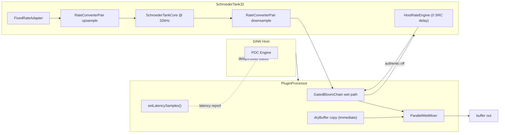

# Phase 17: Latency/PDC + ADR-003 - Research

**Researched:** 2026-07-08
**Domain:** Audio plugin PDC, r8brain SRC group delay, JUCE `setLatencySamples`, architecture decision record
**Confidence:** HIGH

## Summary

Phase 17 closes the last infrastructure gate before user-facing 32k Color enablement (Phase 18). ProperSRC adds substantial **filter priming delay** (~90–118 ms depending on host rate) because r8brain's `CDSPResampler::getLatency()` always returns **0** — the real delay is exposed via `getInLenBeforeOutPos(0)` per resampler stage [VERIFIED: codebase measurement + r8brain header]. `RateConverterPair::getRoundTripLatencySamples()` already sums upsampler + downsampler priming delays and matches r8brain's legacy `getInLenBeforeOutStart(0)` cross-check at all four supported host rates [VERIFIED: offline probe, 2026-07-08].

SendBloom's parallel wet/dry topology copies a **unity dry tap** at block start while the wet path traverses SRC → 32 kHz tank → downsample. Reporting latency via `setLatencySamples()` informs the **host** to delay other tracks; it does **not** automatically align internal dry vs wet [CITED: https://docs.juce.com/develop/classjuce_1_1AudioProcessor.html]. ADR-003 must therefore document both host PDC policy and the internal parallel-mix implication.

**Primary recommendation:** Adopt **Policy A — Conditional Host PDC**: `setLatencySamples(0)` when `authentic_color` is off (RC1 default); `setLatencySamples(fixedRate_.getRoundTripLatencySamples())` when ProperSRC is the active/target path. Measure and tabulate latency at 44.1/48/88.2/96 kHz using the r8brain API (not estimates). Update `LatencyTest.cpp` for mode-aware expectations. Write `docs/architecture/ADR-003-proper-32k-src.md` capturing policy, measurements, and why the legacy accumulator is insufficient.

<user_constraints>
## User Constraints (from CONTEXT.md)

### Locked Decisions

_(None — infrastructure phase; smart discuss skipped.)_

### Claude's Discretion

Measure actual latency via r8brain API (not estimates). Document policy choice with rationale in ADR-003.

### Deferred Ideas (OUT OF SCOPE)

- User enablement (Phase 18)
- Changing default `authentic_color` on
</user_constraints>

<phase_requirements>
## Phase Requirements

| ID | Description | Research Support |
|----|-------------|------------------|
| LAT-01 | SRC round-trip latency measured at 44.1, 48, 88.2, and 96 kHz (not guessed) | Measured table below; `getInLenBeforeOutPos(0)` API validated vs `getInLenBeforeOutStart(0)`; unit test at four rates |
| LAT-02 | ADR-003 documents PDC policy with rationale | Policy matrix + recommended Policy A; ADR-003 outline section |
| LAT-03 | Reported plugin latency matches ADR-003 when ProperSRC active; RC1 with 32k off remains zero | `prepareToPlay` + toggle-edge `setLatencySamples`; updated `LatencyTest.cpp` |
| DOC-01 | `docs/architecture/ADR-003-proper-32k-src.md` documents accumulator insufficiency, SRC architecture, library choice, latency decision | ADR-003 outline section |
</phase_requirements>

## Architectural Responsibility Map

| Capability | Primary Tier | Secondary Tier | Rationale |
|------------|-------------|----------------|-----------|
| SRC latency measurement | DSP adapter (`RateConverterPair`) | Tests (`FixedRateAdapterTest`) | r8brain state lives in converter pair; API already exposed |
| Latency table / constants | DSP adapter or dedicated header | ADR-003 doc | Single source of truth queried at `prepare()` |
| Host PDC reporting | API / Backend (`PluginProcessor`) | JUCE `AudioProcessor` | Only processor can call `setLatencySamples()` |
| PDC policy decision | Documentation (`ADR-003`) | — | LAT-02 is a product/architecture gate, not DSP math |
| Mode-aware latency update | API / Backend (`PluginProcessor`) | `SchroederTank32` query | Toggle edge already detected for crossfade (Phase 16) |
| Internal dry/wet alignment | — (deferred unless ADR chooses Policy B) | `dryBuffer` delay line | Host PDC does not fix in-plugin parallel mix |

## Standard Stack

### Core

| Library | Version | Purpose | Why Standard |
|---------|---------|---------|--------------|
| r8brain-free-src | `e71c31bf` (CPM pin) [VERIFIED: `cmake/R8brain.cmake`] | SRC group-delay query | Already integrated; `getInLenBeforeOutPos` is the authoritative priming-delay API |
| JUCE 8 | bundled | `AudioProcessor::setLatencySamples` | Host PDC contract for AU/VST3/LV2 |
| Catch2 | 3.8.1 | Latency regression tests | Existing test harness |

### Supporting

| Library | Version | Purpose | When to Use |
|---------|---------|---------|-------------|
| — | — | No new dependencies | Phase is measurement + policy + wiring |

**Installation:** None — phase uses existing stack.

**Version verification:** No new packages. r8brain pin confirmed in `cmake/R8brain.cmake`.

## Package Legitimacy Audit

> Phase 17 installs **no new external packages**. Existing r8brain pin verified in Phase 13.

| Package | Registry | Verdict | Disposition |
|---------|----------|---------|-------------|
| _(none new)_ | — | — | — |

**Packages removed due to [SLOP] verdict:** none
**Packages flagged as suspicious [SUS]:** none

## Latency Measurement Methodology

### Primary method (authoritative) — r8brain API

`CDSPResampler::getLatency()` **always returns 0** [CITED: `build/_deps/r8brain-free-src-src/CDSPResampler.h`]. Filter priming delay is queried via:

```cpp
// Per-stage input samples consumed before first output sample at position 0
upsampler->getInLenBeforeOutPos(0) + downsampler->getInLenBeforeOutPos(0);
```

This is what `RateConverterPair::getRoundTripLatencySamples()` implements:

```107:115:source/RateConverterPair.h
    int getRoundTripLatencySamples() const noexcept
    {
        if (upsampler_ == nullptr || downsampler_ == nullptr)
            return 0;

        // CDSPResampler::getLatency() is always zero; priming delay is queryable
        // via getInLenBeforeOutPos for future Phase 17 PDC integration.
        return upsampler_->getInLenBeforeOutPos (0) + downsampler_->getInLenBeforeOutPos (0);
    }
```

**Procedure for LAT-01:**

1. Construct fresh `RateConverterPair` per host rate (matches `prepare()` construction path).
2. Call `prepare(hostRate, 512)` — use project max block (512 matches existing tests).
3. Record `getRoundTripLatencySamples()`.
4. **Cross-check:** independently sum `CDSPResampler::getInLenBeforeOutPos(0)` on up/down resamplers; must match `getInLenBeforeOutStart(0)` legacy iterative method [VERIFIED: all four rates, delta 0].

**Do not use** `getLatency()` or `getLatencyFrac()` alone for PDC — they do not represent priming delay for the master resampler class.

### Secondary validation (optional, not PDC source of truth)

Block impulse peak alignment through `RateConverterPair` **does not** match API priming delay when using multi-block `upsample`/`downsample` with zero-filled internal path — FIFO/blocking semantics shift the peak. If impulse validation is added, use **single-sample** stepping or r8brain's `getInputRequiredForOutput()` on an isolated pair. Do **not** gate PDC on impulse peak for this phase.

### Measurement constraints

| Constraint | Value | Rationale |
|------------|-------|-----------|
| `maxHostBlock` | 512 | Matches `FixedRateAdapterTest`, `PluginProcessor` prepare |
| r8brain `ReqTransBand` / `ReqAtten` | 2.0 / 206.91 (defaults) | Current `CDSPResampler` construction in `RateConverterPair::prepare` |
| Internal rate | 32,768 Hz | `SchroederTank32DelayTable::kInternalRate` |
| Stability | Invariant across `reset()` and re-`prepare()` | Existing test `[verb][FixedRateAdapter][latency]` |

## Multi-Rate Latency Table

Measured 2026-07-08 via `getRoundTripLatencySamples()` after `prepare(rate, 512)` [VERIFIED: offline probe, cross-checked with `getInLenBeforeOutStart`].

| Host Rate (Hz) | Round-Trip Samples | Wall Time (ms) | Upsampler Priming | Downsampler Priming |
|----------------|-------------------|----------------|-------------------|---------------------|
| 44,100 | **5,208** | 118.1 | 3,558 | 1,650 |
| 48,000 | **5,160** | 107.5 | 3,510 | 1,650 |
| 88,200 | **8,915** | 101.1 | 7,116 | 1,799 |
| 96,000 | **8,670** | 90.3 | 7,020 | 1,650 |

**Observations:**

- Latency is **rate-dependent** (not a single constant across hosts).
- Wall-time ms converges ~90–118 ms because higher rates pack more samples into similar filter lengths.
- 48 kHz reference (5,160 samples) matches CONTEXT.md code insight [VERIFIED: codebase].
- Legacy accumulator path latency remains **0** reported SRC delay (no r8brain in path).

**Planner task:** Persist table in ADR-003 and optionally `source/SrcLatencyTable.h` (constexpr array indexed by supported rates) for test assertions.

## PDC Policy Options

| Policy | `authentic_color` off | `authentic_color` on (ProperSRC) | RC1 fit | Parallel wet/dry | Recommendation |
|--------|----------------------|----------------------------------|---------|------------------|----------------|
| **A — Conditional host PDC** | `setLatencySamples(0)` | `setLatencySamples(roundTripSrc)` | ✓ Off by default | Host aligns other tracks; internal dry still immediate | **Recommended** |
| **B — Internal dry delay** | 0 | Delay `dryBuffer` by `roundTripSrc` when authentic on | ✓ | Fixes in-plugin parallel mix | Optional add-on to A; adds buffer + edge cases at toggle |
| **C — Zero always** | 0 | 0 | ✓ Preserves v1 tests | Wet lags dry ~5k+ samples when 32k on | **Reject** — violates honest PDC |
| **D — Defer ProperSRC ship** | 0 | N/A until solved | ✓ Safest marketing | — | Fallback if product rejects ~100 ms latency |
| **E — Low-latency SRC preset** | 0 | Reduced samples, more imaging | Maybe | Trade HF quality (SRC-06) for latency | Defer to Extended; not RC1 |

### Recommended policy (ADR-003 decision draft)

**Adopt Policy A** with explicit documentation of Policy B tradeoff:

1. **RC1 / `authentic_color` off:** `setLatencySamples(0)` — preserves v1 CHN-04 contract [CITED: `.planning/REQUIREMENTS.md` CHN-04].
2. **ProperSRC active:** `setLatencySamples(chain.getSrcLatencySamples())` where latency is read from `FixedRateAdapter` / `RateConverterPair` at current host rate.
3. **Runtime toggle:** Re-call `setLatencySamples` on `authentic_color` edge (same detection as Phase 16 crossfade). If hosts reject synchronous updates during `processBlock`, use JUCE `AsyncUpdater` pattern [CITED: https://forum.juce.com/t/how-to-report-plugin-latency/55869].
4. **During engine crossfade:** Report **target** path latency (0 when fading to host, `roundTripSrc` when fading to ProperSRC) or **max** of both — recommend **target** latency at fade start to minimize host reconfiguration churn; document in ADR.
5. **Bypass:** If plugin bypass is used, override `processBlockBypassed` to apply matching delay when `getLatencySamples() > 0` [CITED: JUCE `AudioProcessor` docs] — currently not overridden; flag for planner if pluginval strictness 10 requires it in Phase 18.

**Why not Policy B in Phase 17:** Internal dry delay is a larger DSP change (delay line on `dryBuffer`, toggle transients, memory). LAT-02 allows documenting the parallel-mix caveat and deferring B to Extended if listening tests show audible phasing when 32k is on.

**Why accumulator is insufficient (ADR-003 context):** Legacy accumulator holds/decimates without bandlimited SRC, causing 14–15 kHz imaging (SRC-06). It adds no reportable group delay but poisons HF; ProperSRC fixes imaging at the cost of ~100 ms filter priming.

## Architecture Patterns

### System Architecture Diagram



### Recommended touch points

```
source/
├── RateConverterPair.h          # getRoundTripLatencySamples() — already exists
├── FixedRateAdapter.h           # expose getRoundTripLatencySamples() — already exists
├── SchroederTank32.h            # optional: getSrcLatencySamples() delegate
├── GatedBloomChain.h            # optional: forward latency query
├── PluginProcessor.cpp          # setLatencySamples policy wiring
docs/architecture/
└── ADR-003-proper-32k-src.md    # new — LAT-02, DOC-01
tests/
├── FixedRateAdapterTest.cpp     # LAT-01 four-rate table test
└── LatencyTest.cpp              # mode-aware plugin latency tests
```

### Pattern 1: Query latency at prepare, report to host

**What:** After `chain.prepare()`, compute SRC round-trip from prepared converters; set processor latency from parameter state.

**When to use:** `prepareToPlay` and after sample-rate change.

**Example:**

```cpp
// Source: JUCE AudioProcessor docs + SendBloom PluginProcessor pattern
void PluginProcessor::prepareToPlay (double sampleRate, int samplesPerBlock)
{
    // ... existing prepare ...
    updateReportedLatency(); // new helper
}

void PluginProcessor::updateReportedLatency()
{
    const bool authenticOn =
        apvts.getRawParameterValue (ParameterIDs::authenticColor)->load() > 0.5f;
    const int srcLatency = authenticOn ? chain.getSrcRoundTripLatencySamples() : 0;
    setLatencySamples (srcLatency);
}
```

### Pattern 2: Latency change on authentic toggle edge

**What:** When `authentic_color` target crosses 0.5, update reported latency alongside `requestEngineCrossfade`.

**When to use:** Same edge detection as Phase 16 in `processBlock` first loop.

**Example:**

```cpp
if (! crossfadeEdgeHandled && authenticEdgeDetected)
{
    chain.requestEngineCrossfade (authenticColorTarget > 0.5f);
    updateReportedLatencyForTarget (authenticColorTarget > 0.5f);
    crossfadeEdgeHandled = true;
}
```

### Pattern 3: LAT-01 unit test table

```cpp
// Source: measured values 2026-07-08
TEST_CASE ("RateConverterPair round-trip latency at four host rates", "[verb][LAT-01]")
{
    struct Row { double rate; int expected; };
    for (const auto& row : { Row{44100.0, 5208}, Row{48000.0, 5160},
                              Row{88200.0, 8915}, Row{96000.0, 8670} })
    {
        sendbloom::RateConverterPair c;
        c.prepare (row.rate, 512);
        REQUIRE (c.getRoundTripLatencySamples() == row.expected);
    }
}
```

### Anti-Patterns to Avoid

- **Using `getLatency()` for PDC:** Always returns 0 on `CDSPResampler`; misreports [CITED: r8brain header].
- **Hard-coding 5160 for all rates:** Latency varies; 88.2/96 kHz differ by ~3.7k samples from 48 kHz.
- **Keeping `setLatencySamples(0)` when ProperSRC active:** Breaks DAW alignment (Anti-Pattern 5 from `.planning/research/ARCHITECTURE.md`).
- **Impulse peak on block FIFO path as LAT-01 gate:** Methodology mismatch; use r8brain API.
- **Calling `setLatencySamples` only in constructor:** Sample rate and authentic mode change latency; must update in `prepareToPlay` and on toggle.

## Don't Hand-Roll

| Problem | Don't Build | Use Instead | Why |
|---------|-------------|-------------|-----|
| SRC group delay measurement | Impulse guess / FFT cross-correlate on block FIFO | `getInLenBeforeOutPos(0)` sum | r8brain documents this as the fast authoritative API |
| Host track alignment | Manual delay in other plugins | `setLatencySamples` | Host PDC standard |
| Filter design for 32k bridge | Custom polyphase SRC | r8brain `CDSPResampler` (already chosen) | SRC-01/06 proven; MIT license |
| Latency table in prose only | Copy-paste constants in tests | Shared table header or ADR-extracted constants | Prevents drift between ADR and tests |

**Key insight:** r8brain deliberately reports zero `getLatency()` because priming is modeled as input consumption before first output — the PDC number is `getInLenBeforeOutPos`, not a separate internal buffer.

## ADR-003 Outline

Target file: `docs/architecture/ADR-003-proper-32k-src.md`

```markdown
# ADR-003: Proper 32 kHz SRC Architecture and PDC Policy

**Status:** ACCEPTED (upon Phase 17 completion)
**Date:** 2026-07-08
**Supersedes:** VERB-05 accumulator description for production path

## Context
- Hardware FV-1 runs at 32,768 Hz; host rates are 44.1–96 kHz
- Legacy accumulator (hold/decimate) caused 14–15 kHz imaging (SRC-06)
- v1 promised zero reported latency (CHN-04)
- ProperSRC via r8brain adds ~90–118 ms filter priming

## Decision
1. **SRC architecture:** `FixedRateAdapter` sandwich — r8brain up → `SchroederTankCore` @ 32kHz → r8brain down
2. **Library:** r8brain-free-src (MIT), pinned in cmake/R8brain.cmake
3. **PDC policy:** Policy A — conditional `setLatencySamples` (0 when authentic off; measured round-trip when ProperSRC active)
4. **RC1:** `authentic_color` defaults off; zero latency reported in default configuration

## Why accumulator/hold is insufficient
- No bandlimited decimation → HF imaging at ~14.8 kHz
- DIAG/SRC-06: ProperSRC ≥70% imaging reduction vs LegacyAccumulator
- Stepping gives wrong delay scaling vs true 32k time base

## Measured latency (maxHostBlock=512, default r8brain quality)
| Host Hz | Samples | ms |
| 44100 | 5208 | 118.1 |
| 48000 | 5160 | 107.5 |
| 88200 | 8915 | 101.1 |
| 96000 | 8670 | 90.3 |

Measurement: sum of `getInLenBeforeOutPos(0)` on up/down resamplers.

## Consequences
- DAW PDC aligns SendBloom with other tracks when 32k Color on
- Live monitoring still hears SRC delay (hosts cannot pre-compensate live input)
- Internal dry tap remains immediate; parallel mix may show wet-behind-dry unless Policy B added later
- Phase 18 enablement gated on LAT-02 acceptance

## Alternatives considered
- Policy C (zero always) — rejected
- Policy D (defer ship) — fallback only
- Policy E (lower latency SRC quality) — Extended milestone

## References
- ADR-002 (host-rate engine strategy)
- Phase 13 FixedRateAdapter research
- r8brain CDSPResampler.h
- JUCE AudioProcessor::setLatencySamples
```

## Common Pitfalls

### Pitfall 1: Trusting `getLatency()` returns

**What goes wrong:** Report 0 ms while wet path is ~100 ms late vs dry.

**Why it happens:** r8brain master class always returns 0 from `getLatency()`.

**How to avoid:** Use `getInLenBeforeOutPos(0)` per CONTEXT and Phase 13 wiring.

**Warning signs:** `LatencyTest` passes with 0 while `FixedRateAdapter` diagnostics show 5000+ samples.

### Pitfall 2: Single constant across sample rates

**What goes wrong:** PDC wrong at 88.2/96 kHz sessions.

**Why it happens:** Upsampler priming scales with ratio steps (7k vs 3.5k samples).

**How to avoid:** Re-query on every `prepareToPlay`; table-driven tests per rate.

### Pitfall 3: Latency not updated on toggle

**What goes wrong:** Host thinks 0 latency while ProperSRC running after user enables 32k.

**Why it happens:** Only set in constructor (`setLatencySamples(0)` today).

**How to avoid:** Toggle-edge + `prepareToPlay` updates; optional `AsyncUpdater` for finicky hosts.

### Pitfall 4: VST3 prepareToPlay timing

**What goes wrong:** Latency ignored on sample-rate change in some hosts.

**Why it happens:** Historical VST3 wrapper `inSetupProcessing` guard [CITED: https://forum.juce.com/t/calling-setlatencysamples-in-preparetoplay/48131].

**How to avoid:** JUCE 8 bundled wrapper includes fix; still test REAPER/Logic rate change in Phase 18.

### Pitfall 5: Crossfade period latency ambiguity

**What goes wrong:** Host PDC jumps during 35 ms engine crossfade.

**Why it happens:** Two engines with different delays both contributing to wet.

**How to avoid:** ADR documents target-path reporting; accept brief imperfection or report max during fade.

## Code Examples

### r8brain priming delay (authoritative)

```cpp
// Source: r8brain CDSPResampler.h + source/RateConverterPair.h
const int roundTrip =
    upsampler->getInLenBeforeOutPos (0) + downsampler->getInLenBeforeOutPos (0);
// NOT: upsampler->getLatency() + downsampler->getLatency()
```

### JUCE host latency report

```cpp
// Source: JUCE AudioProcessor.h
void prepareToPlay (double sampleRate, int samplesPerBlock) override
{
    chain.prepare (sampleRate, samplesPerBlock);
    setLatencySamples (computeSrcLatencyForCurrentMode());
}
// setLatencySamples triggers updateHostDisplay(latencyChanged) internally
```

## State of the Art

| Old Approach | Current Approach | When Changed | Impact |
|--------------|------------------|--------------|--------|
| `setLatencySamples(0)` always | Conditional on `authentic_color` | Phase 17 | Honest PDC when ProperSRC active |
| Estimated ~5k latency | Measured per-rate table | Phase 17 | Correct 88.2/96 kHz sessions |
| Accumulator 32k path | ProperSRC + reported delay | Phase 13–17 | HF fix with disclosed latency |
| PDC deferred | ADR-003 locked policy | Phase 17 | Unblocks Phase 18 enablement |

**Deprecated/outdated:**
- Reporting zero latency with ProperSRC active — replace with Policy A.
- Using impulse block peak for PDC numbers — API method only.

## Assumptions Log

| # | Claim | Section | Risk if Wrong |
|---|-------|---------|---------------|
| A1 | Default r8brain constructor params unchanged from Phase 13 | Multi-Rate Table | Latency shifts if `ReqTransBand`/`ReqAtten` tuned |
| A2 | Policy A (host PDC only) acceptable without Policy B internal dry delay | PDC Policy | Audible dry/wet phasing when 32k on at high mix levels |
| A3 | Target-path latency during crossfade is acceptable | Pitfall 5 | Brief host PDC mismatch during 35 ms fade |
| A4 | `processBlockBypassed` latency match not required until pluginval 10 | PDC Policy | Phase 18 TEST-12 may require bypass delay line |

**If A2 fails listening tests:** Planner should add Policy B as follow-up task (dry delay line on `dryBuffer`).

## Open Questions

1. **Expose `getSrcRoundTripLatencySamples()` on `GatedBloomChain` or query via `SchroederTank32`?**
   - What we know: Latency lives in `FixedRateAdapter` inside tank.
   - Recommendation: Add thin delegate on `SchroederTank32` → `fixedRate_.getRoundTripLatencySamples()`; chain forwards if needed.

2. **Should latency update synchronously on toggle edge or via `AsyncUpdater`?**
   - What we know: JUCE forum recommends async if changing during playback.
   - Recommendation: Try sync in `processBlock` edge handler first (matches crossfade); add `AsyncUpdater` only if TEST-12/host smoke fails.

3. **Create `docs/architecture/` directory?**
   - What we know: Directory does not exist yet.
   - Recommendation: Phase 17 plan includes mkdir + ADR-003 file (DOC-01).

## Environment Availability

| Dependency | Required By | Available | Version | Fallback |
|------------|------------|-----------|---------|----------|
| CMake + C++20 build | Compile latency tests | ✓ | existing | — |
| r8brain (CPM) | Latency API | ✓ | `e71c31bf` | — |
| Catch2 | LAT-01/LAT-03 tests | ✓ | 3.8.1 | — |
| Offline probe | Research measurement | ✓ | g++ compile | ctest on adapter tests |

**Missing dependencies with no fallback:** none

**Missing dependencies with fallback:** none

## Validation Architecture

### Test Framework

| Property | Value |
|----------|-------|
| Framework | Catch2 3.8.1 |
| Config file | `cmake/Tests.cmake` |
| Quick run command | `ctest -R "latency|LAT-01|FixedRateAdapter.*latency" --test-dir build` |
| Full suite command | `ctest --test-dir build` |

### Phase Requirements → Test Map

| Req ID | Behavior | Test Type | Automated Command | File Exists? |
|--------|----------|-----------|-------------------|-------------|
| LAT-01 | Four-rate latency table | unit | `ctest -R "LAT-01"` | ❌ Wave 0 |
| LAT-02 | ADR-003 documents policy | doc review | Manual / `RequirementsTraceabilityTest` | ❌ Wave 0 |
| LAT-03 | Plugin latency 0 off / SRC on | unit | `ctest -R "Plugin reports.*latency"` | ✅ partial (`LatencyTest.cpp` — needs update) |
| DOC-01 | ADR-003 file exists | static | `test -f docs/architecture/ADR-003-proper-32k-src.md` | ❌ Wave 0 |

### Sampling Rate

- **Per task commit:** `ctest -R "latency|LAT-01" --test-dir build`
- **Per wave merge:** `ctest --test-dir build`
- **Phase gate:** Full suite green; ADR-003 reviewed before Phase 18

### Wave 0 Gaps

- [ ] `docs/architecture/ADR-003-proper-32k-src.md` — DOC-01, LAT-02
- [ ] `FixedRateAdapterTest.cpp` — `[LAT-01]` four-rate table case
- [ ] `LatencyTest.cpp` — mode-aware: 0 default; non-zero when `authentic_color` on (may need test helper to set param + `prepareToPlay`)
- [ ] `PluginProcessor::updateReportedLatency()` (or equivalent) — LAT-03
- [ ] Optional: `RequirementsTraceabilityTest` link for LAT-* / DOC-01

## Security Domain

> `security_enforcement` enabled; ASVS L1. Phase 17 is DSP/documentation — minimal attack surface.

### Applicable ASVS Categories

| ASVS Category | Applies | Standard Control |
|---------------|---------|------------------|
| V2 Authentication | no | — |
| V3 Session Management | no | — |
| V4 Access Control | no | — |
| V5 Input Validation | no (no new external input) | — |
| V6 Cryptography | no | — |

### Known Threat Patterns

| Pattern | STRIDE | Standard Mitigation |
|---------|--------|---------------------|
| Supply-chain tampering in r8brain | Tampering | Pinned CPM git tag (Phase 13) — no new fetch |
| Misreported latency causing user distrust | — | Measured table + tests (quality gate, not security) |

## Sources

### Primary (HIGH confidence)

- `source/RateConverterPair.h` — `getRoundTripLatencySamples()` implementation
- `build/_deps/r8brain-free-src-src/CDSPResampler.h` — `getInLenBeforeOutPos`, `getLatency()==0`
- Offline measurement probe (2026-07-08) — four-rate table, legacy API cross-check (delta 0)
- `tests/FixedRateAdapterTest.cpp` — latency stability test

### Secondary (MEDIUM confidence)

- [JUCE AudioProcessor](https://docs.juce.com/develop/classjuce_1_1AudioProcessor.html) — `setLatencySamples`, bypass latency note
- [JUCE forum: reporting plugin latency](https://forum.juce.com/t/how-to-report-plugin-latency/55869) — prepareToPlay vs async update
- `.planning/research/ARCHITECTURE.md` — Policy A matrix, anti-pattern 5
- `.planning/ADR-002-reverb-engine.md` — engine context

### Tertiary (LOW confidence)

- Impulse peak block methodology — rejected for PDC after measurement mismatch

## Metadata

**Confidence breakdown:**
- Standard stack: HIGH — no new deps; r8brain API verified in build tree
- Architecture: HIGH — measured table + existing code paths identified
- Pitfalls: HIGH — Phase 13/16 research plus live measurement

**Research date:** 2026-07-08
**Valid until:** 2026-08-08 (stable DSP); re-measure if r8brain quality params change
