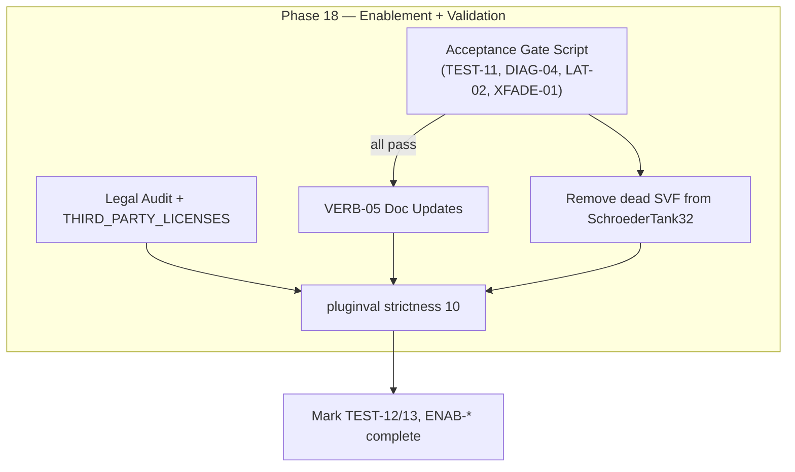

# Phase 18: Enablement + Validation - Research

**Researched:** 2026-07-09
**Domain:** Release validation, legal compliance, documentation truth, legacy DSP demotion
**Confidence:** HIGH

## Summary

Phase 18 is the v2.0 **ship-readiness gate** — not a DSP feature phase. All four upstream acceptance prerequisites (TEST-11, DIAG-04, LAT-02, XFADE-01) are **complete and green** in the local `build/` tree: 12/12 targeted gate tests pass, and the full Catch2 suite is **192/192** [VERIFIED: `ctest --test-dir build`, 2026-07-09]. `pluginval` strictness **10** also passes on the post-integration VST3 locally (~15 s, including Authentic Color parameter fuzz) [VERIFIED: pluginval v1.0.3 macOS, Debug VST3, 2026-07-09].

Remaining work is **documentation honesty**, **legal attribution for r8brain**, and **dead-code cleanup**:

1. **TEST-12** — Re-verify `pluginval` 10 on CI matrix (Release VST3) after v2.0 integration; local proof exists but REQUIREMENTS.md still marks pending until CI/local Release artifact is confirmed.
2. **TEST-13** — `scripts/check-legal-metadata.sh` passes today but does **not** assert r8brain MIT citation; add `docs/THIRD_PARTY_LICENSES.md` (or equivalent) and extend the script.
3. **ENAB-02** — README, RELEASE_CHECKLIST, REQUIREMENTS VERB-05, and `ReleaseTruthTest.cpp` still describe the **accumulator + anti-image SVF** path; production code routes `authentic_color` through `FixedRateAdapter` / ProperSRC [VERIFIED: `source/SchroederTank32.h`, `source/FixedRateAdapter.h`].
4. **ENAB-03** — `antiImageFilter` / `processAuthentic` in `SchroederTank32.h` is **dead code** (never called); demote by removing from the production class while retaining SVF in `LegacyAccumulatorPath.h` for A/B regression only.
5. **ENAB-01** — Verify gates (automated checklist below); **do not** flip `authentic_color` default or factory presets to on unless explicitly requested — CONTEXT.md marks that out of scope.

**Primary recommendation:** Run the acceptance gate script → extend legal audit for r8brain MIT → update VERB-05 docs and ReleaseTruthTest → remove dead anti-image SVF from `SchroederTank32` → re-run full suite + pluginval 10 on Release VST3 → mark TEST-12/TEST-13/ENAB-* complete in REQUIREMENTS.md.

<user_constraints>
## User Constraints (from CONTEXT.md)

### Locked Decisions

*(No locked implementation decisions — CONTEXT.md lists discretion only.)*

### Claude's Discretion

All at discretion. Verify acceptance gates before any enablement. Update docs honestly.

### Deferred Ideas (OUT OF SCOPE)

- Changing `authentic_color` default to on (ENAB gates must pass first; default stays off unless explicitly enabled per requirements)
</user_constraints>

<phase_requirements>
## Phase Requirements

| ID | Description | Research Support |
|----|-------------|------------------|
| TEST-12 | pluginval strictness 10 passes after integration | CI workflow already at level 10 [VERIFIED: `.github/workflows/build_and_test.yml`]; local post-v2 pass confirmed; Release artifact + matrix re-run recommended |
| TEST-13 | Legal metadata audit passes with r8brain MIT license cited | Script passes banned-term scan [VERIFIED: 2026-07-09]; gap = no r8brain/MIT assertion — add `docs/THIRD_PARTY_LICENSES.md` + script grep |
| ENAB-01 | 32k Color may be enabled by default only after TEST-11, DIAG-04, LAT-02, XFADE-01 pass | All four gates green locally — see Acceptance Gate Checklist; default flip remains out of scope per CONTEXT |
| ENAB-02 | VERB-05 documentation updated to describe ProperSRC bandlimited bridge, not accumulator stepping | Files to update identified: README, RELEASE_CHECKLIST, REQUIREMENTS VERB-05, ReleaseTruthTest; ADR-003 is canonical technical source |
| ENAB-03 | Anti-image SVF demoted or removed after ProperSRC passes HF acceptance gates | HF gates pass; SVF only needed in `LegacyAccumulatorPath`; remove dead SVF from `SchroederTank32` |
</phase_requirements>

## Architectural Responsibility Map

| Capability | Primary Tier | Secondary Tier | Rationale |
|------------|-------------|----------------|-----------|
| Acceptance gate verification | CI / test harness | Human release checklist | Automated ctest + pluginval; LAT-02 ADR human sign-off already done in Phase 17 |
| pluginval 10 validation | CI (GitHub Actions) | Local macOS Release build | Host compatibility tool runs on built VST3 binary, not in-plugin |
| Legal metadata audit | Shell script (`scripts/`) | Product docs (`docs/`) | Banned-term scan is script-owned; third-party attribution is doc-owned |
| VERB-05 doc truth | Documentation (`docs/`, README) | ReleaseTruthTest (static doc tests) | Docs are user-facing; test enforces consistency |
| Anti-image SVF demotion | DSP source (`source/`) | Test updates | Production path is ProperSRC; SVF stays only in legacy diagnostics tier |
| ENAB-01 gate permission | Requirements / release process | — | Policy decision, not a code path |

## Acceptance Gate Checklist

> **ENAB-01 prerequisite.** All items must pass before claiming v2.0 32k Color is validated for user enablement. This phase **verifies** gates; flipping `authentic_color` default or presets to on is **out of scope** unless explicitly requested.

### Gate 1 — TEST-11: HF ringing regression (ProperSRC @ 48 kHz)

| Check | Command | Expected | Status |
|-------|---------|----------|--------|
| Guitar 10k RMS ratio bounded | `ctest --test-dir build -C Release -R "HF ringing authentic bright guitar 10k"` | Pass | ✅ Local 2026-07-09 |
| No narrowband whistle | `ctest --test-dir build -C Release -R "HF ringing no narrowband glass"` | Pass | ✅ |
| 14825 Hz imaging suppressed | `ctest --test-dir build -C Release -R "HF ringing authentic path imaging band"` | Pass | ✅ |
| Finite authentic output | `ctest --test-dir build -C Release -R "HF ringing authentic path finite"` | Pass | ✅ |
| SRC-06 imaging reduction | `ctest --test-dir build -C Release -R "14825 Hz imaging vs LegacyAccumulator"` | Pass | ✅ |

### Gate 2 — DIAG-04: ProperSRC host-rate invariance

| Check | Command | Expected | Status |
|-------|---------|----------|--------|
| HF metrics across 44.1/48/96 kHz | `ctest --test-dir build -C Release -R "ProperSRC HF metrics invariant across host rates"` | Pass | ✅ Local 2026-07-09 |
| Three-path harness | `ctest --test-dir build -C Release -R "Three-path render matrix"` | Pass | ✅ |

### Gate 3 — LAT-02: ADR-003 PDC policy documented

| Check | Command / Action | Expected | Status |
|-------|------------------|----------|--------|
| ADR exists | `test -f docs/architecture/ADR-003-proper-32k-src.md` | Policy A: 0 when off, measured round-trip when ProperSRC on | ✅ Phase 17 |
| Human acceptance | Phase 17 SUMMARY / plan sign-off | LAT-02 accepted | ✅ Per `.planning/phases/17-*` |
| LAT-03 wiring | `ctest --test-dir build -C Release -R "Plugin reports SRC latency"` | Pass | ✅ |

### Gate 4 — XFADE-01: Engine crossfade 20–50 ms clickless

| Check | Command | Expected | Status |
|-------|---------|----------|--------|
| Fade duration | `ctest --test-dir build -C Release -R "EngineCrossfade fade duration"` | Pass | ✅ Local 2026-07-09 |
| Mid-buffer toggle | `ctest --test-dir build -C Release -R "EngineCrossfade mid-buffer"` | Pass | ✅ |
| Click metric | `ctest --test-dir build -C Release -R "EngineCrossfade normalized click"` | Pass | ✅ |
| 1000-toggle stress | `ctest --test-dir build -C Release -R "processBlock survives 1000 authentic_color toggles"` | Pass | ✅ |

### Composite gate script (planner Wave 0 / phase entry)

```bash
#!/usr/bin/env bash
set -euo pipefail
ROOT="$(cd "$(dirname "$0")/.." && pwd)"
BUILD="${BUILD_DIR:-$ROOT/build}"

ctest --test-dir "$BUILD" -C Release --output-on-failure -R \
  "HF ringing.*regression|ProperSRC HF metrics invariant|EngineCrossfade|processBlock survives 1000 authentic_color|Plugin reports SRC latency|14825 Hz imaging vs LegacyAccumulator"

test -f "$ROOT/docs/architecture/ADR-003-proper-32k-src.md"
echo "ENAB-01 acceptance gates: PASS"
```

### RC1 safety invariants (must remain true after Phase 18)

| Invariant | Verification |
|-----------|--------------|
| `authentic_color` APVTS default off | `ctest -R "INTEG-04.*defaults off"` |
| All 8 factory presets `authentic_color=0` | `ctest -R "factory presets recall authentic_color off"` |
| Host-rate tank when color off | Production path in `SchroederTank32::processBlock` when `!authenticColor` |

## pluginval Strictness 10 Approach

### What level 10 exercises [CITED: Tracktion/pluginval repository]

| Aspect | Level 10 behavior |
|--------|-------------------|
| Thoroughness | Most exhaustive mode: extended runs, parameter fuzzing, bus/layout tests |
| Real-time safety | macOS `rtcheck` when enabled (CI uses default child-process validation) |
| Formats | SendBloom validates **VST3 only** in CI; AU not pluginval'd [VERIFIED: `.github/workflows/build_and_test.yml`, `docs/RELEASE_CHECKLIST.md`] |
| Binary | pluginval **v1.0.3** downloaded per matrix OS from GitHub releases |

### CI invocation (canonical)

```bash
# After cmake Release build; .env from Builds provides VST3_PATH
curl -LO "https://github.com/Tracktion/pluginval/releases/download/v1.0.3/pluginval_${OS}.zip"
7z x pluginval_${OS}.zip
${PLUGINVAL_BINARY} --strictness-level 10 --verbose --validate "${VST3_PATH}"
```

Environment: `STRICTNESS_LEVEL: 10` in workflow `env` block [VERIFIED: `.github/workflows/build_and_test.yml`].

### Local verification (macOS)

```bash
cmake -B build -DCMAKE_BUILD_TYPE=Release
cmake --build build --config Release --target SendBloom_VST3
# Download pluginval v1.0.3 if not installed
pluginval --strictness-level 10 --verbose --validate \
  "build/SendBloom_artefacts/Release/VST3/SendBloom.vst3"
```

**Local result (2026-07-09):** Debug VST3 (post-v2 integration) passed level 10 in ~15 s, including fuzz of parameter 11 (Authentic Color) [VERIFIED: local run]. Release artifact should be re-validated to close TEST-12 formally.

### v2.0 integration risks and mitigations

| Risk | Evidence | Mitigation |
|------|----------|------------|
| **Non-zero latency** when `authentic_color` on (~5k–9k samples) | `PluginProcessor::updateReportedLatency` [VERIFIED: `source/PluginProcessor.cpp`] | Policy A reports measured SRC delay; latency tests pass |
| **`processBlockBypassed` vs latency** | JUCE default asserts `getLatencySamples() == 0` in debug if bypassed without matching delay [CITED: JUCE `AudioProcessor::processBypassed`] | SendBloom returns non-null `getBypassParameter()` — hosts use bypass **parameter** in `processBlock`, not `processBlockBypassed` [CITED: JUCE `getBypassParameter` docs]. pluginval level 10 passed without override. |
| **ADR-003 bypass delay line** | Flagged for Phase 18 if TEST-12 fails | **Not required** given local pluginval pass; add delay-line bypass only if a host-specific failure appears |
| **Authentic Color fuzz** | pluginval fuzzed param 11 | Passed |

### TEST-12 completion criteria

1. Full Catch2 suite green (192 tests locally).
2. `pluginval --strictness-level 10` passes on **Release** VST3.
3. CI matrix green on `main` (macOS, Windows, Linux) — legal audit + ctest + pluginval leg.

## Legal Metadata Audit (TEST-13)

### Current script behavior [VERIFIED: `scripts/check-legal-metadata.sh`]

| Check | Scope |
|-------|-------|
| **Required terms** in `CMakeLists.txt` | SendBloom, NkMo, SbLm, Niko Audio Labs |
| **Banned terms** | Rainger, Reverb-X, Igor, Pamplejuce, Pamp, P001 |
| **Scanned paths** | `source/`, `tests/`, `README.md`, `.github/workflows/`, `resources/presets/`, `resources/` |

**Gap for TEST-13:** No assertion that **r8brain-free-src (MIT)** is cited in product-facing documentation. Script passes today without any r8brain mention [VERIFIED: `bash scripts/check-legal-metadata.sh`, 2026-07-09].

### r8brain license facts [VERIFIED: `build/_deps/r8brain-free-src-src/LICENSE`]

- **Package:** r8brain-free-src (CPM pin in `cmake/R8brain.cmake`, commit `e71c31bf…`)
- **License:** MIT, Copyright (c) 2013-2025 Aleksey Vaneev
- **Usage:** Header-only include via `target_link_libraries(SharedCode INTERFACE r8brain)` [VERIFIED: `CMakeLists.txt`]

### Recommended TEST-13 implementation

**1. Add `docs/THIRD_PARTY_LICENSES.md`** (product-facing, scanned by script):

```markdown
## r8brain-free-src

SendBloom's ProperSRC path uses [r8brain-free-src](https://github.com/avaneev/r8brain-free-src)
(MIT License, Copyright (c) 2013-2025 Aleksey Vaneev) for bandlimited sample-rate conversion
between host rate and the 32,768 Hz Schroeder tank core. See ADR-003 and `cmake/R8brain.cmake` for integration details.
```

**2. Extend `scripts/check-legal-metadata.sh`** after banned-term scan:

```bash
echo "==> Checking third-party license citations..."
for file in docs/THIRD_PARTY_LICENSES.md README.md; do
  [[ -f "$file" ]] || { echo "ERROR: Missing $file" >&2; exit 1; }
  grep -qi "r8brain" "$file" || { echo "ERROR: r8brain not cited in $file" >&2; exit 1; }
  grep -qi "MIT" "$file" || { echo "ERROR: MIT license not cited in $file" >&2; exit 1; }
done
```

**3. Optional README cross-link** — one line under Legal & Clean-Room pointing to `docs/THIRD_PARTY_LICENSES.md`.

**Do not** vendor r8brain LICENSE into `source/` — attribution in docs satisfies TEST-13; CPM fetch is build-time only.

## VERB-05 Documentation Updates (ENAB-02)

### Current vs target truth

| Location | Current (stale) | Target (ProperSRC) |
|----------|-----------------|-------------------|
| `README.md` L14 | "steps the tank at 32,768 Hz (resampled to host rate)"; ProperSRC "awaits Phases 13–18" | Bandlimited host ↔ 32,768 Hz bridge via r8brain ProperSRC when 32k Color on; off-by-default unchanged |
| `docs/RELEASE_CHECKLIST.md` §32k Color Truth | `processAuthentic` accumulator + `kAuthenticAntiImageLpHz` SVF | ProperSRC sandwich per ADR-003; legacy accumulator noted as diagnostics-only |
| `.planning/REQUIREMENTS.md` VERB-05 | "steps tank DSP at 32,768 Hz (resampled to host rate)" | "bandlimited hostRate ↔ 32,768 Hz SRC via r8brain; tank at fixed delay table" |
| `tests/ReleaseTruthTest.cpp` | Requires `processAuthentic` in `SchroederTank32.h` | Assert ProperSRC / `FixedRateAdapter` in production path; `processAuthentic` only in `LegacyAccumulatorPath.h` |

### Canonical technical description (copy source: ADR-003)

When **32k Color** (`authentic_color`) is enabled:

- Input is upsampled to **32,768 Hz** via r8brain (`FixedRateAdapter` / `RateConverterPair`).
- `SchroederTankCore` runs at fixed delay-table lengths with per-comb RT60 calibration, damping, and optional 9-bit quantization.
- Output is downsampled to host rate via r8brain (bandlimited decimation).
- Reported plugin latency = measured SRC round-trip priming delay (Policy A); **zero** when color off.
- **Original software** — not firmware-derived. Legacy accumulator + anti-image SVF exists only under `Authentic32Mode::LegacyAccumulator` for regression.

### ReleaseTruthTest migration

Replace:

```cpp
REQUIRE (tankSource.find ("processAuthentic") != std::string::npos);
```

With assertions such as:

```cpp
REQUIRE (tankSource.find ("FixedRateAdapter") != std::string::npos);
REQUIRE (tankSource.find ("ProperSRC") != std::string::npos);
const auto legacySource = readTextFile (root.getChildFile ("source/LegacyAccumulatorPath.h"));
REQUIRE (legacySource.find ("processAuthentic") != std::string::npos);
```

Keep existing bans on EEPROM/bytecode in README.

### RC1 Safety Freeze section

Update `docs/RELEASE_CHECKLIST.md` RC1 subsection:

- Remove "ProperSRC is **not shipped**" (obsolete after v2.0 validation).
- Replace experimental disclaimer with: "ProperSRC validated; 32k Color remains **off by default** until product explicitly enables default-on."
- Retain preset/default-off invariants.

## Anti-Image SVF Demotion Strategy (ENAB-03)

### Why demote now

| Path | Anti-image SVF | Role |
|------|----------------|------|
| **ProperSRC** (production) | **None** | r8brain bandlimited up/down removes 16.384 kHz foldback [VERIFIED: `source/FixedRateAdapter.h`] |
| **LegacyAccumulator** (diagnostics) | 12 kHz host-rate SVF (`kAuthenticAntiImageLpHz`) | Masks accumulator imaging for A/B only [VERIFIED: `source/LegacyAccumulatorPath.h`] |
| **SchroederTank32** (facade) | SVF prepared but **never used** | Dead code from pre–Phase 14 refactor [VERIFIED: no call sites to `processAuthentic` in `SchroederTank32.h`] |

HF acceptance gates that justify demotion:

- `FixedRateAdapter ProperSRC reduces 14825 Hz imaging vs LegacyAccumulator` — pass
- TEST-11 HF ringing suite — pass
- DIAG-04 invariance — pass

### Recommended demotion plan (prescriptive)

| Step | File | Action |
|------|------|--------|
| 1 | `source/SchroederTank32.h` | **Remove** `antiImageFilter`, `processAuthentic()`, `inputAccumulator`, `outputHold`, `lastInternalOut`, and related `prepare()` setup |
| 2 | `source/LegacyAccumulatorPath.h` | **Keep** SVF; add comment: `// Legacy accumulator only — not used in ProperSRC production path` |
| 3 | `source/SchroederTank32DelayTable.h` | Update `kAuthenticAntiImageLpHz` comment to `// LegacyAccumulatorPath only` |
| 4 | `tests/ReleaseTruthTest.cpp` | Point `processAuthentic` assertion at `LegacyAccumulatorPath.h` (see ENAB-02) |
| 5 | `docs/RELEASE_CHECKLIST.md` | Remove anti-image SVF from production 32k Color description |

**Do not remove** `LegacyAccumulatorPath` or `Authentic32Mode::LegacyAccumulator` — Phase 15 diagnostics and SRC-06 regression depend on them [VERIFIED: `tests/FixedRateAdapterTest.cpp`, `tests/AuthenticPathDiagnosticsTest.cpp`].

### Verification after demotion

```bash
ctest --test-dir build -C Release -R "LegacyAccumulator|14825 Hz imaging|HF ringing.*regression|ReleaseTruth"
cmake --build build --config Release
# pluginval 10 smoke
```

## Standard Stack

### Core

| Library | Version | Purpose | Why Standard |
|---------|---------|---------|--------------|
| pluginval | 1.0.3 | VST3/AU validation | Tracktion-maintained; CI-pinned; level 10 industry gate [VERIFIED: CI workflow] |
| Catch2 | 3.8.1 | Acceptance + regression tests | Already project test framework [VERIFIED: `cmake/Tests.cmake`] |
| r8brain-free-src | CPM pin `e71c31bf` | ProperSRC (existing) | Already integrated Phase 13; MIT [VERIFIED: `cmake/R8brain.cmake`] |

### Supporting

| Tool | Version | Purpose | When to Use |
|------|---------|---------|-------------|
| `scripts/check-legal-metadata.sh` | repo | Banned/required term scan | Every CI leg + Phase 18 TEST-13 extension |
| `ctest` | CMake bundled | Gate + full suite | Phase entry and ship |
| GitHub Actions matrix | ubuntu-22.04, macos-14, windows-latest | Cross-platform TEST-12 | Push/PR to `main` |

### Alternatives Considered

| Instead of | Could Use | Tradeoff |
|------------|-----------|----------|
| Extend legal script | Manual legal review only | Script gives repeatable TEST-13; manual is error-prone |
| Remove SVF entirely | Keep in SchroederTank32 | Dead code confuses VERB-05; legacy path still needs SVF for fair A/B |
| pluginval 5 | pluginval 10 | TEST-12 explicitly requires 10; SCAF-04 raised bar before release |

**Installation:** Phase 18 installs **no new packages**.

## Package Legitimacy Audit

> Phase 18 does not add external dependencies. r8brain was verified in Phase 13. No new `npm install` / CPM packages for this phase.

| Package | Registry | Verdict | Disposition |
|---------|----------|---------|-------------|
| *(none new)* | — | — | N/A |

**Packages removed due to SLOP verdict:** none
**Packages flagged as suspicious [SUS]:** none

*TEST-13 attribution is documentation-only — cite existing r8brain-free-src MIT, do not add a new package.*

## Architecture Patterns

### System Architecture Diagram



### Recommended task order

```
1. Run acceptance gate composite script (fail-fast if regression)
2. Add docs/THIRD_PARTY_LICENSES.md + extend check-legal-metadata.sh
3. Update VERB-05 docs (README, RELEASE_CHECKLIST, REQUIREMENTS) + ReleaseTruthTest
4. Remove dead anti-image SVF from SchroederTank32.h
5. Full ctest + Release build + pluginval 10 (local + CI)
6. Update REQUIREMENTS.md checkboxes
```

### Pattern 1: Doc truth enforced by static tests

**What:** `ReleaseTruthTest.cpp` reads repo files and asserts marketing/DSP claims.
**When to use:** Any user-visible DSP description change (ENAB-02).
**Example:**

```cpp
// After ENAB-02: production path cites ProperSRC, legacy cites accumulator
REQUIRE (readme.find ("ProperSRC") != std::string::npos);
REQUIRE (readme.find ("accumulator") == std::string::npos); // or scoped to "legacy"
```

### Anti-Patterns to Avoid

- **Flipping `authentic_color` default on** without explicit product decision — ENAB-01 grants permission after gates, CONTEXT forbids automatic default change.
- **Deleting `LegacyAccumulatorPath`** — breaks SRC-06 and three-path diagnostics.
- **Claiming zero latency with ProperSRC active** — violates LAT-03 / ADR-003 Policy A.
- **Skipping Release pluginval** — Debug pass ≠ TEST-12 closure; CI uses Release.

## Don't Hand-Roll

| Problem | Don't Build | Use Instead | Why |
|---------|-------------|-------------|-----|
| Plugin host compatibility | Custom VST3 fuzz harness | pluginval strictness 10 | Covers buses, parameters, threading edge cases |
| Legal term scanning | Ad-hoc grep in plan | `scripts/check-legal-metadata.sh` | Repeatable CI gate; extend for r8brain |
| Third-party license file | Inline README only | `docs/THIRD_PARTY_LICENSES.md` | TEST-13 auditability; keeps README concise |
| Anti-image filtering on ProperSRC path | Extra host SVF after r8brain | r8brain bandlimited SRC only | SRC-06 proves SVF was accumulator band-aid |

**Key insight:** Phase 18 is validation and truth-telling — the engineering fix (ProperSRC) is already shipped in code; this phase makes docs, legal, and dead code match reality.

## Common Pitfalls

### Pitfall 1: Stale VERB-05 confuses users and future agents

**What goes wrong:** README still says accumulator stepping; developers re-enable SVF on ProperSRC path.
**Why it happens:** Phase 11–17 intentionally deferred doc updates.
**How to avoid:** Update all four doc surfaces in one task; fix ReleaseTruthTest in same commit.
**Warning signs:** `ReleaseTruthTest` passes while README mentions `processAuthentic` in production.

### Pitfall 2: TEST-13 false positive

**What goes wrong:** Legal script passes but r8brain MIT never cited.
**Why it happens:** Original script scoped to Rainger clean-room only.
**How to avoid:** Add explicit r8brain + MIT grep to script.
**Warning signs:** `grep -r r8brain docs/` returns only ADR-003 (architecture, not license file).

### Pitfall 3: pluginval pass on Debug only

**What goes wrong:** TEST-12 marked complete without Release binary validation.
**Why it happens:** Local `build/` defaults to Debug on some configures.
**How to avoid:** Explicit `-DCMAKE_BUILD_TYPE=Release` and validate `SendBloom_artefacts/Release/VST3/`.
**Warning signs:** Artifact path contains `Debug/` in pluginval command.

### Pitfall 4: Removing SVF from legacy path

**What goes wrong:** LegacyAccumulator A/B and SRC-06 tests change character or fail.
**Why it happens:** Treating all SVF instances as production debt.
**How to avoid:** Demote only `SchroederTank32.h` dead code; keep `LegacyAccumulatorPath.h` intact.
**Warning signs:** `ctest -R LegacyAccumulator` failures after ENAB-03.

## Code Examples

### Acceptance gate entry

```bash
ctest --test-dir build -C Release --output-on-failure -R \
  "HF ringing.*regression|ProperSRC HF metrics invariant|EngineCrossfade|processBlock survives 1000"
test -f docs/architecture/ADR-003-proper-32k-src.md
bash scripts/check-legal-metadata.sh
```

### pluginval 10 (matches CI)

```bash
pluginval --strictness-level 10 --verbose --validate \
  "build/SendBloom_artefacts/Release/VST3/SendBloom.vst3"
```

### Production vs legacy path (current code)

```cpp
// source/SchroederTank32.h — production authentic path
const auto mode = diagnosticsMode_.value_or (Authentic32Mode::ProperSRC);
fixedRate_.processBlock (input, output, numSamples, rt60Seconds, darkMix, mode);

// source/FixedRateAdapter.h — ProperSRC has no anti-image SVF
case Authentic32Mode::ProperSRC:
    converters.upsample (...);
    core.processSample (...);
    converters.downsample (...);
```

## State of the Art

| Old Approach | Current Approach | When Changed | Impact |
|--------------|------------------|--------------|--------|
| VERB-05 docs describe accumulator | ProperSRC + ADR-003 | Phase 18 (pending) | Honest user-facing truth |
| Anti-image SVF on production path | r8brain only | Phase 14 code / Phase 18 cleanup | ENAB-03 removes dead SVF |
| pluginval 10 at v1 integration | Re-verify post-v2 SRC/latency | Phase 18 TEST-12 | Confirms host safety with non-zero latency |
| Legal scan: Rainger terms only | + r8brain MIT citation | Phase 18 TEST-13 | Distribution compliance |

**Deprecated/outdated:**
- `SchroederTank32::processAuthentic` in production — use `FixedRateAdapter::ProperSRC`.
- RELEASE_CHECKLIST "ProperSRC not shipped" — remove after validation.

## Assumptions Log

| # | Claim | Section | Risk if Wrong |
|---|-------|---------|---------------|
| A1 | pluginval 10 on Debug VST3 implies Release VST3 will pass | pluginval | Optimizations could differ; always run Release for TEST-12 sign-off |
| A2 | `getBypassParameter()` non-null avoids `processBlockBypassed` latency assert in all hosts | pluginval | Exotic host may still call bypassed path — add delay line if reported |
| A3 | `docs/THIRD_PARTY_LICENSES.md` satisfies TEST-13 without SPDX in CMake | Legal | Legal review may want CMake `NOTICE` file — extend if required |
| A4 | ENAB-01 does not require flipping default on | User Constraints | Product may expect preset enablement — confirm with stakeholder |

**If gates regress:** Re-run phase 15–17 diagnostics before any doc enablement claims.

## Open Questions

1. **Should factory presets re-enable `authentic_color=1` after gates?**
   - What we know: SAFE-02 froze presets off; ENAB-01 is permission, CONTEXT excludes default-on.
   - What's unclear: Product intent for "Bloom" factory character.
   - Recommendation: Leave presets at 0 unless user explicitly requests preset update task.

2. **AU pluginval in CI?**
   - What we know: RELEASE_CHECKLIST lists AU as manual gap.
   - Recommendation: Out of scope for TEST-12; document as post-v1 deferred (FMT/AU CI).

3. **Bypass delay line for offline render?**
   - What we know: ADR-003 flagged; pluginval 10 passed without it.
   - Recommendation: Defer unless host-specific bug report; do not block TEST-12.

## Environment Availability

| Dependency | Required By | Available | Version | Fallback |
|------------|------------|-----------|---------|----------|
| CMake | Build + ctest | ✓ | 4.3.3 | — |
| Node.js | gsd-tools | ✓ | v22.22.3 | — |
| Catch2 | Gate tests | ✓ | 3.8.1 (CPM) | — |
| pluginval | TEST-12 | ✓ (download) | 1.0.3 | CI curl fetch |
| 7z | CI pluginval unzip | ✓ in CI | — | Local: `unzip` on macOS |
| Release VST3 artifact | pluginval | ⚠️ | Debug built locally | `cmake -DCMAKE_BUILD_TYPE=Release` |
| GitHub Actions | Cross-platform TEST-12 | ✓ [ASSUMED] | — | Local macOS only |

**Missing dependencies with no fallback:**
- None for Phase 18 doc/validation work.

**Missing dependencies with fallback:**
- Release build locally → configure with `-DCMAKE_BUILD_TYPE=Release`.

## Validation Architecture

### Test Framework

| Property | Value |
|----------|-------|
| Framework | Catch2 3.8.1 |
| Config file | `cmake/Tests.cmake` |
| Quick run command | `ctest --test-dir build -C Release -R "HF ringing.*regression|ProperSRC HF metrics invariant|EngineCrossfade"` |
| Full suite command | `ctest --test-dir build -C Release --output-on-failure` |
| pluginval command | `pluginval --strictness-level 10 --verbose --validate <Release VST3 path>` |

### Phase Requirements → Test Map

| Req ID | Behavior | Test Type | Automated Command | File Exists? |
|--------|----------|-----------|-------------------|-------------|
| TEST-12 | pluginval 10 post-integration | external | `pluginval --strictness-level 10 --validate …` | ✅ workflow + local pass |
| TEST-13 | Legal + r8brain MIT | script | `bash scripts/check-legal-metadata.sh` | ⚠️ extend for r8brain |
| ENAB-01 | Acceptance gates | integration | composite gate script above | ✅ |
| ENAB-02 | VERB-05 doc truth | static | `ctest -R "32k Color docs describe"` | ✅ update assertions |
| ENAB-03 | SVF demoted from production | unit/regression | `ctest -R "HF ringing|14825 Hz imaging|LegacyAccumulator"` | ✅ |

### Sampling Rate

- **Per task commit:** `ctest -R "ReleaseTruth|HF ringing authentic path imaging"` (fast doc + HF smoke)
- **Per wave merge:** full `ctest` (192 tests) + `check-legal-metadata.sh`
- **Phase gate:** pluginval 10 on Release VST3 + CI green

### Wave 0 Gaps

- [ ] `docs/THIRD_PARTY_LICENSES.md` — r8brain MIT citation (TEST-13)
- [ ] `scripts/check-legal-metadata.sh` — r8brain/MIT grep assertions
- [ ] `tests/ReleaseTruthTest.cpp` — ProperSRC assertions (ENAB-02)
- [ ] Release VST3 local build path for pluginval sign-off

## Security Domain

### Applicable ASVS Categories

| ASVS Category | Applies | Standard Control |
|---------------|---------|-----------------|
| V2 Authentication | no | — |
| V3 Session Management | no | — |
| V4 Access Control | no | — |
| V5 Input Validation | no (phase scope) | Existing APVTS ranges unchanged |
| V6 Cryptography | no | — |

### Known Threat Patterns

| Pattern | STRIDE | Standard Mitigation |
|---------|--------|---------------------|
| Banned trademark leakage | Repudiation | `check-legal-metadata.sh` scan |
| Undocumented third-party dependency | Information disclosure | THIRD_PARTY_LICENSES + TEST-13 |

## Project Constraints (from .cursor/rules/)

No `.cursor/rules/` directory found in project root [VERIFIED: glob 2026-07-09]. No additional Cursor rule directives apply.

## Sources

### Primary (HIGH confidence)

- Codebase: `source/SchroederTank32.h`, `source/FixedRateAdapter.h`, `source/LegacyAccumulatorPath.h`, `source/PluginProcessor.cpp`
- Codebase: `scripts/check-legal-metadata.sh`, `.github/workflows/build_and_test.yml`
- Codebase: `docs/architecture/ADR-003-proper-32k-src.md`, `docs/RELEASE_CHECKLIST.md`
- Local verification: `ctest` 192/192, pluginval 10 pass (2026-07-09)
- `build/_deps/r8brain-free-src-src/LICENSE` — MIT text

### Secondary (MEDIUM confidence)

- [JUCE AudioProcessor API](https://docs.juce.com/master/classjuce_1_1AudioProcessor.html) — `setLatencySamples`, `getBypassParameter`, `processBlockBypassed`
- [Tracktion/pluginval](https://github.com/Tracktion/pluginval) — strictness levels, CLI flags

### Tertiary (LOW confidence)

- pluginval rtcheck behavior on non-macOS CI legs — validate via CI logs if TEST-12 flakes

## Metadata

**Confidence breakdown:**
- Standard stack: HIGH — no new packages; existing CI/test tooling verified locally
- Architecture: HIGH — acceptance gates measured green; doc gaps precisely mapped
- Pitfalls: HIGH — stale docs and dead SVF confirmed by grep and test inventory

**Research date:** 2026-07-09
**Valid until:** 2026-08-09 (stable release-validation domain; re-run if phases 15–17 regress)
